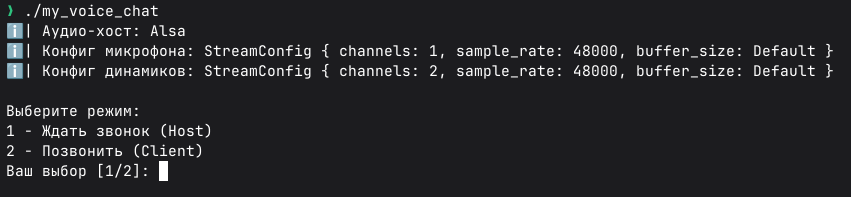

# my_voice_chat

Небольшой проект общения 1 на 1

### Из особенностей:

- Сжатие и декомпрессия звука через OPUS (audiopus);
- Iroh (QUIC) как транспорт звука;
- cpal для работы со звуком;
- Кольцевые буфера (ringbuf) для передачи звука;

### Как пользоваться:

Два пользователя должны запустить клиент и один из них должен выбрать `1 - Ждать звонок (Host)`, а другой `2 - Позвонить (Client)`.
При выборе ожидания звонка хосту будет выдан `EndpointId` для подключения к нему звонящего. Звонящему нужно ввести в приложении полученный `EndpointId` и после этого ждать установку соединения, после которого можно общаться 1 на 1.
